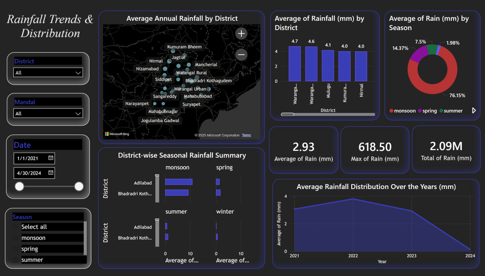
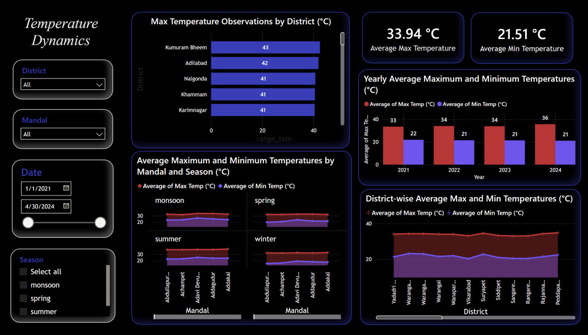

# Telangana State Weather Data Analysis

## 📊 Overview
Comprehensive weather data analysis for Telangana State covering 2021-2024. This project includes raw datasets, processed data, interactive dashboards, and detailed visualizations of weather patterns across different districts and mandals.

## 📁 Project Structure

### Extracted Data
- **2021/** - Complete weather data for 2021
- **2022/** - Complete weather data for 2022
- **2023/** - Complete weather data for 2023
- **2024/** - Complete weather data for 2024
- Each year contains CSV/XLSX files with daily observations

### Raw Data (`raw_data/`)
- **Weather Data.rar** - Original compressed weather dataset
- Extract using WinRAR, 7-Zip, or similar tools

## 🚀 How to Use This Project

### 1. **Explore the Data**
- Navigate to `Weather Data/extracted_data/` folder
- View data by year (2021-2024)
- Use `data_overview.png` for summary statistics

### 2. **View Dashboards**
- Open PNG files in `visualizations/` for quick visual reference
- Open `.pbix` file in Power BI Desktop for interactive exploration
- Apply filters to analyze specific districts or time periods

### 3. **Reproduce the Analysis**
- Extract raw data from `Weather Data.rar` if needed
- Import processed data into Power BI for visualization
- Follow the same analysis workflow

## 📋 Requirements

See `requirements.txt` for Python dependencies (if using Python for additional analysis)

### Software Requirements:
- **Power BI Desktop** - for creating/viewing dashboards
- **File Extraction Tool** - WinRAR, 7-Zip, or similar for .rar files

## 📦 File Formats
- **CSV files** - Raw and processed weather data
- **XLSX files** - Formatted data with multiple sheets
- **RAR files** - Compressed original dataset
- **PNG files** - Static visualizations and exports
- **PBIX files** - Power BI interactive dashboards

## 🎨 Visualizations

### Static Visualizations

#### 1. Humidity Trend Overview

#### 2. Rainfall Trends & Distribution

#### 3. Temperature Dynamics

#### 4. Wind Speed Metrics

## 📊 Key Findings

### This analysis reveals:
- Significant temperature variations across districts
- Monsoon-driven rainfall patterns in specific regions
- Humidity-temperature correlations during different seasons
- Wind speed variations and their seasonal changes
- District-specific weather characteristics

## 📊 Dashboards & Visualizations

### Main Dashboard
- **Telangana Weather Dashboard.pbix** - Interactive Power BI dashboard with:
  - Real-time data filters by district, year, and date range
  - Temperature trends and extremes
  - Rainfall distribution and monsoon analysis
  - Wind speed patterns
  - Humidity correlations

### Static Visualizations
Quick reference PNG exports available in `visualizations/` folder:
- Humidity Trend Overview
- Rainfall Trends & Distribution
- Temperature Dynamics
- Wind Speed Metrics

## 🔗 Dataset Information
- **Time Period**: 2021-2024
- **Geographic Coverage**: Telangana State districts and mandals
- **Data Frequency**: Daily observations
- **Data Quality**: Cleaned and validated weather observations
- **Data Size**: Multi-year comprehensive dataset
- **Data Format**: CSV, XLSX, RAR compressed

> ⭐ **If you find this project helpful, please consider starring this repository!** It helps others discover this project and motivates continued development.
